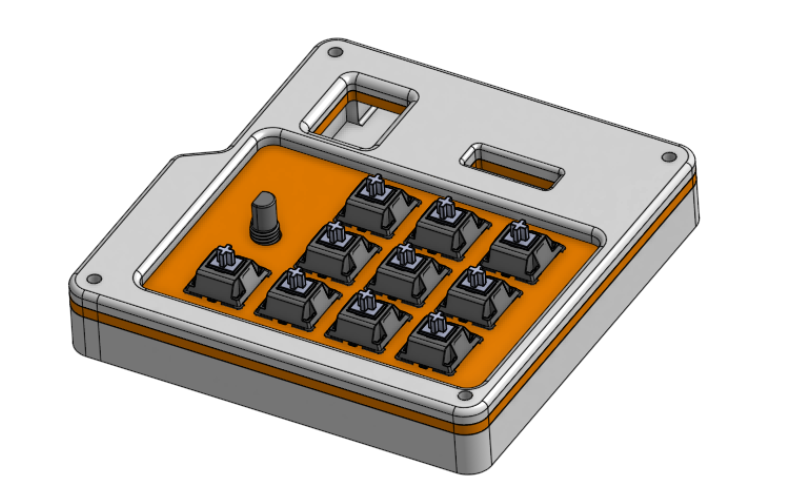

# RhythmPad
The RhythmPad is a 10-key macropad sponsored by Hack Club, powered by a Seeed XIAO RP2040! Additionally, it features 1  rotary encoder(with switch) and a 0.91 OLED screen. While colors are inspired by NASA's SLS rocket, it's meant for rhythm games such as Pulsus and 4-key rhythm games (like FNF). 
It supports 2 layers and uses QMK firmware. 

