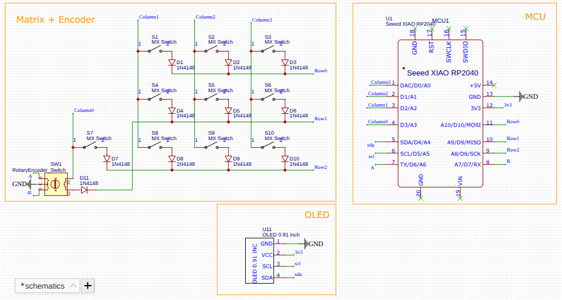
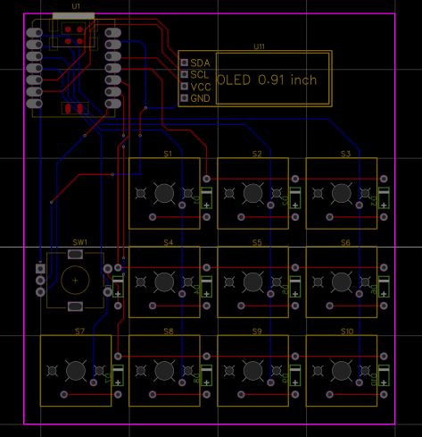
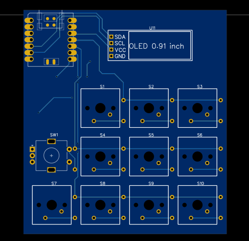
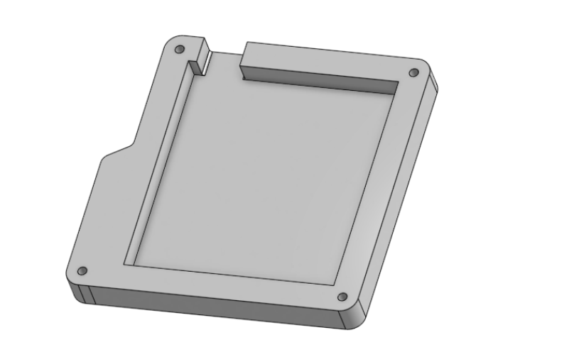
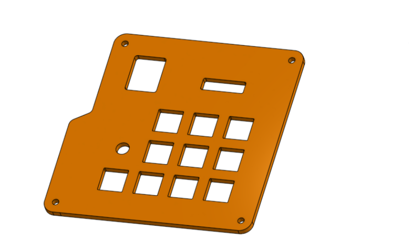
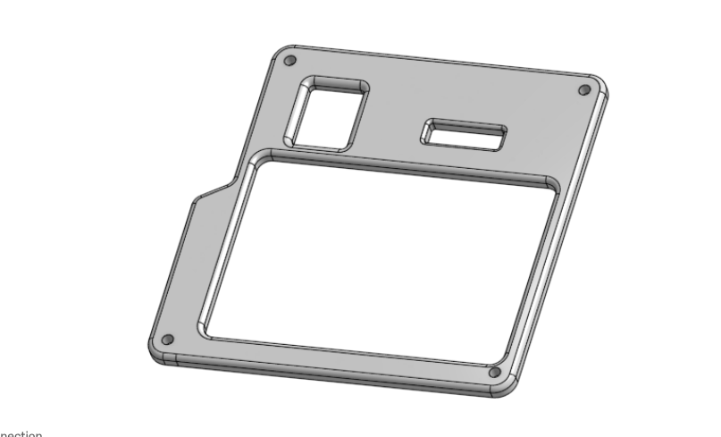

# RhythmPad
The RhythmPad is a 10-key macropad sponsored by Hack Club, powered by a Seeed XIAO RP2040! Additionally, it features 1  rotary encoder(with switch) and a 0.91 OLED screen. While colors are inspired by NASA's SLS rocket, it's meant for rhythm games such as Pulsus and 4-key rhythm games (like FNF). 
It supports 2 layers and uses QMK firmware. 

I mainly made this to get out of my comfort zone and dabble in hardware! Additionally, I love rhythm games and found I prefer mechanical switches when playing over my laptop's keys. This allows to me to plug and play whenever I want :)

## Features:
  - 132x28 0.91-inch OLED display
  - 1x EC11E Rotary Encoder
  - 10x MX-Style Switches w/ DSA Keycaps
  - Seeed XIAO RP2040
  - QMK Software

## PCB
The PCB was designed in EasyEDA Standard. All the symbols and footprints were sourced from the User-Contributed Library.
### Schematics: 

### PCB Layout:

# Model
The CAD model was created in Onshape! It uses a sandwich mounting style, featuring a bottom frame, plate, and top frame.
It uses 4 M3x16mm screws, inserted from the top into the M3x5mmx4mm heatset inserts in the bottom frame. 
Additionally, the rotary knob was made by Kea Workshop! I simply added my own design of Saturn on top. Their model can be found here: [Click here to visit the printables page](https://www.printables.com/model/1000044-ec11-encoder-knob)

